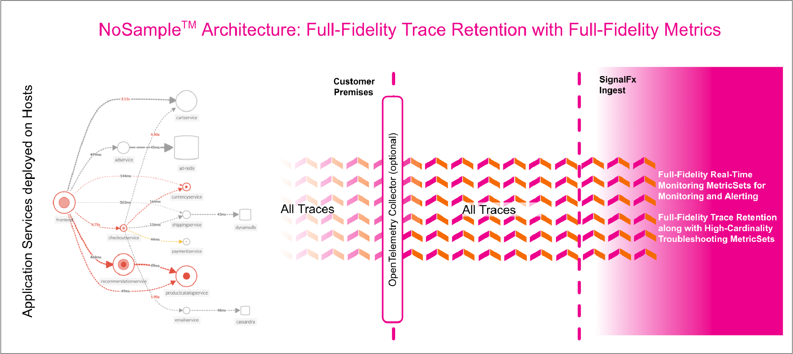

# µAPM Architecture Overview

!!! important "Enabling µAPM"

    **If you recently signed up for the 14 day free trial then this section of the workshop cannot be completed!**
    
    An Organization needs to be pre-provisioned as a µAPM entitlement is required for the purposes of this module. Please contact someone from SignalFx to get a trial instance with µAPM enabled if you don’t have one already.

    To check if you have an Organization with µAPM enabled, just login to SignalFx and check that you have the µAPM tab on the top navbar next to Dashboards.

SignalFx µAPM captures end-to-end distributed transactions from your applications, with trace spans sent directly to SignalFx or via the SignalFx Smart Agent deployed on each host (recommended).

Optionally, you can deploy an OpenTelemetry Collector to act as a central aggregation point prior to sending trace spans to SignalFx.

In addition to proxying spans and infrastructure metrics, the OpenTelemetry Collector can also perform other functions, such as redacting sensitive tags prior to spans leaving your environment.

The following illustration shows the recommended deployment model: SignalFx auto-instrumentation libraries send spans to the Smart Agent; the Smart Agent can send the spans to SignalFx directly or via an optional OpenTelemetry Collector.

{: .zoom}
